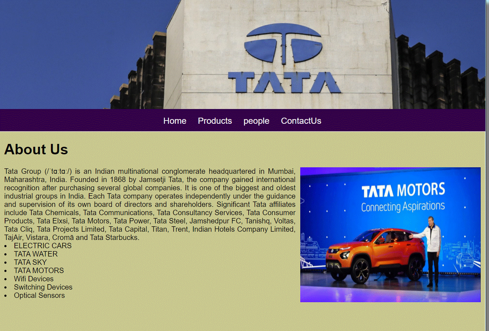
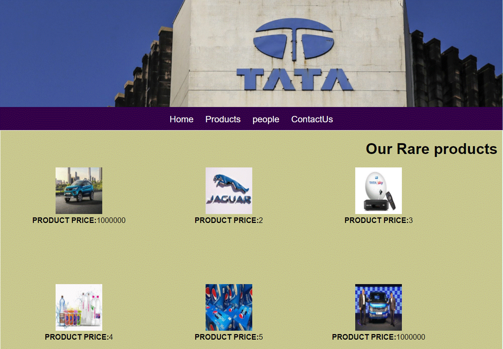
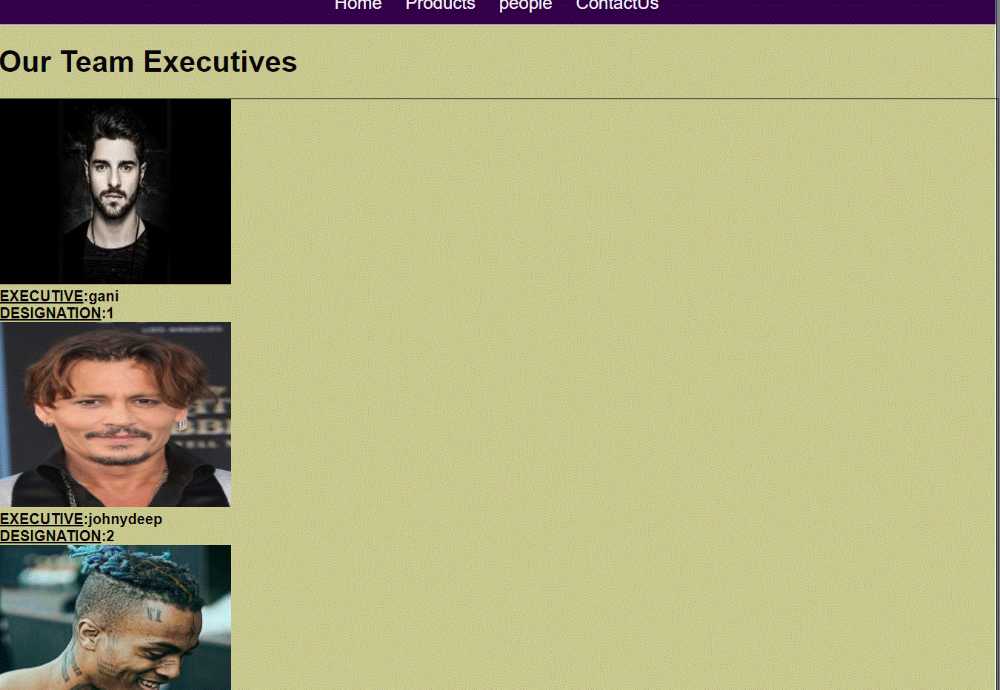
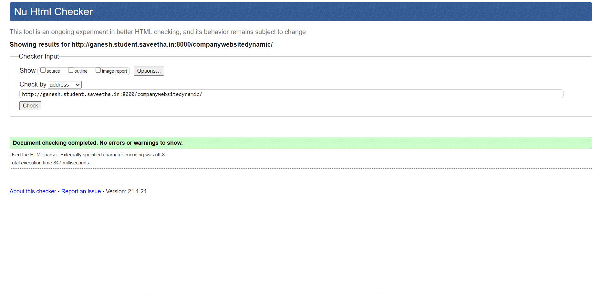

# Dynamic Website Design for a Manufacturing Company
## AIM:
To design a dynamic website for a chip manufacturing company.

## DESIGN STEPS:
### Step 1: 
Requirement collection.
### Step 2:
Creating the layout using HTML and CSS.
### Step 3:
Updating the sample content.
### Step 4:
Choose the appropriate style and color scheme.
### Step 5:
Validate the layout in various browsers.
### Step 6:
Validate the HTML code.
### Step 7:
Create a database model and migrate the database.
### Step 8:
Retrieve data from database and display it in a dynamic webpage.
### Step 9:
Publish the website in the given URL.

## PROGRAM:
### base.html
```
 
<!DOCTYPE html>
<html lang="en">

<head>
    <title>TATA PRIVATE LIMITED</title>
    <link rel="stylesheet" href="">
    <link rel = "icon" href ="" type = "image/x-icone"> 
</head>

<body>
    <div class="container">
    <div class="banner">
    </div>
    <div class="menu">
        <div class="menuitem"><a href="/home">Home</a></div> 
        <div class="menuitem"><a href="/products">Products</a></div> 
        <div class="menuitem"><a href="/people">people</a></div>
        <div class="menuitem"><a href="/contact">contactus</a></div> 
    </div><div class="content">
        
    
    </div>
    <div class="footer">
        Copyright © TATA PRIVATE LIMITED, Developed by GANESH.
    </div>
    </div>
</body>

</html>
 
```

### home.html
```



    <div class="homecontent">    
    <h1>About Us</h1>
    
    <div class="contenttext">
    Tata Group (/ˈtɑːtɑː/) is an Indian multinational conglomerate headquartered in Mumbai, Maharashtra, India. Founded in 1868 by Jamsetji Tata, the company gained international recognition after purchasing several global companies. It is one of the biggest and oldest industrial groups in India. Each Tata company operates independently under the guidance and supervision of its own board of directors and shareholders.

Significant Tata affiliates include Tata Chemicals, Tata Communications, Tata Consultancy Services, Tata Consumer Products, Tata Elxsi, Tata Motors, Tata Power, Tata Steel, Jamshedpur FC, Tanishq, Voltas, Tata Cliq, Tata Projects Limited, Tata Capital, Titan, Trent, Indian Hotels Company Limited, TajAir, Vistara, Cromā and Tata Starbucks.
        <li>ELECTRIC CARS</li>
        <li>TATA WATER</li>
        <li>TATA SKY</li>
        <li>TATA MOTORS</li>
        <li>Wifi Devices</li>
        <li>Switching Devices</li>
        <li>Optical Sensors</li>
    </ul> 
    </div>
    </div>

    
```
### products.html
```



<div class="peoplecontent">
    <h1>Our Rare products</h1>
    <div class="productitems">

        
        <div class="productitem">
            <div class="itemimage">
                
            </div>
            <div class="productsname"><strong>PRODUCT PRICE:</strong>{{ products.price }}
            </div>
        </div>
        
        </div>
    </div>
    
       
```
### people.html
```


<h1 id="Ex">Our Team Executives</h1>
<div class="container">
    
    <div class="peoplelist">
        
        <div class="membername"><strong><u>EXECUTIVE</u>:{{ people.name }}</strong>
        </div>
        <div class="designation"><strong><u>DESIGNATION</u>:{{ people.designation }}
            </strong></div>
    </div>
    
</div>

        
```
### contact.html
```



<form action="//submit.form" id="ContactUs100" method="post" onsubmit="return ValidateForm(this);">
<script type="text/javascript">
function ValidateForm(frm) {
if (frm.Name.value == "") { alert('Name is required.'); frm.Name.focus(); return false; }
if (frm.FromEmailAddress.value == "") { alert('Email address is required.'); frm.FromEmailAddress.focus(); return false; }
if (frm.FromEmailAddress.value.indexOf("@") < 1 || frm.FromEmailAddress.value.indexOf(".") < 1) { alert('Please enter a valid email address.'); frm.FromEmailAddress.focus(); return false; }
if (frm.Comments.value == "") { alert('Please enter comments or questions.'); frm.Comments.focus(); return false; }
return true; }
</script>
<table style="width:100%;max-width:550px;border:0;" cellpadding="8" cellspacing="0">
<tr> <td>
<label for="Name">Name*:</label>
</td> <td>
<input name="Name" type="text" maxlength="60" style="width:100%;max-width:250px;" />
</td> </tr> <tr> <td>
<label for="PhoneNumber">Phone number:</label>
</td> <td>
<input name="PhoneNumber" type="text" maxlength="43" style="width:100%;max-width:250px;" />
</td> </tr> <tr> <td>
<label for="FromEmailAddress">Email address*:</label>
</td> <td>
<input name="FromEmailAddress" type="text" maxlength="90" style="width:100%;max-width:250px;" />
</td> </tr> <tr> <td>
<label for="Comments">Comments*:</label>
</td> <td>
<textarea name="Comments" rows="7" cols="40" style="width:100%;max-width:350px;"></textarea>
</td> </tr> <tr> <td>
* - required fields
</td> <td>
<input name="skip_Submit" type="submit" value="Submit" />
</td> </tr>
</table>
</form>

```
## OUTPUT:







## CODE VALIDATION REPORT:


## RESULT

Thus a website is designed for the chip manufacturing company and is hosted in the URL http://ganesh.student.saveetha.in:8000/. HTML code is validated.
